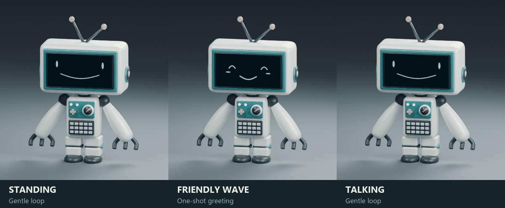

# Robert animation set

Every appearance includes these six skeletal clips in `skins/<id>/model/Robert.glb` and its editable `source/Robert.blend`. They use the existing 24-bone Generic rig, 30 fps, planted feet and no root motion.

| Body clip | Duration | Playback | Motion |
|---|---:|---|---|
| `Standing` | 6.0 s | Loop | Gentle upper-body sway, small head movement and relaxed arms |
| `Idle` | 6.0 s | Loop | Same motion as Standing; preserves the existing clip name |
| `Wave` | 3.2 s | One-shot | Eased arm raise, a few friendly wave beats, then lower |
| `Talk` | 4.8 s | Loop | Subtle alternating hand gestures and nods |
| `Nod` | 1.6 s | One-shot | Existing short nod reaction |
| `Celebrate` | 2.4 s | One-shot | Existing cheerful arm gesture |

Use Standing as the resting state and return to it after Wave, Nod or Celebrate. Play Talk while the app supplies a speech-active presentation cue, then return to Standing. Use approximately 0.2-second crossfades between body states. The clips do not choose their own playback times or trigger application behavior.

## Preview

Individual previews: [standing](previews/Robert_standing.gif), [waving](previews/Robert_waving.gif), [talking](previews/Robert_talking.gif). A [still comparison](previews/animation_collection.png) is also included. Preview GIFs repeat for viewing; Wave remains a one-shot runtime clip.

## Face pairing

Body names are case-sensitive: `Talk` is a skeletal clip; `talk` is a PNG face clip. Use face `idle` with Standing or Idle for occasional blinking, and face `talk` with skeletal Talk for the supplied demonstration mouth cycle. The body and face loops have separate timing. Stop the mouth cycle when speech ends; `RobertFacePlayer.SetFace(neutralPng)` restores a neutral face, or `Play("idle")` resumes blinking.

Whole-face playback supports one sequence at a time. The supplied `talk` cycle already includes a combined mouth-and-blink frame. Starting a separate `blink` interrupts it. These are authored visual gestures and sample mouth frames, not audio lip-sync; production speech may drive faces from sanitized timing or viseme cues.

`shared/animations.json` records body durations, loop intent and suggested face pairing. `shared/faces/default/animations.json` records PNG frame durations in milliseconds. Both are reference manifests; the supplied Unity helpers do not import them automatically. Follow [Unity setup](unity/README.md) to configure Animator states and the existing face player.

## Blender and Unity

In Blender, select `Robert_Rig` and unmute only the desired NLA track. Preview its strip range at 30 fps; leave all tracks muted to inspect the neutral model. Do not play multiple full-body NLA tracks together unless deliberately blending them.

In Unity, configure the compatible Generic rig and disable Apply Root Motion. Set Standing, Idle and Talk to loop, and Wave, Nod and Celebrate to one-shot playback. Use an Animator Controller with Standing as its default state and 0.2-second transitions. Configure the lowercase face clips separately on `RobertFacePlayer`. Each skin prefab needs the same controller setup; swapping a skin restarts its Animator, so reapply the current presentation state after installation.

Run gentle motion only while the character view is visible. On background pause or a hidden character view, stop the Animator and PNG playback; the face player's default unscaled clock is not stopped by `Time.timeScale = 0`. For reduced motion, show a static neutral body pose and PNG instead of playing a Standing loop. Keep Flutter's static-avatar fallback available. These lifecycle decisions belong to the host application and are not automatically implemented by this asset pack.

The Blender previews and export checks do not establish Unity or Android runtime readiness. Import, compile the supplied helpers, and check clip looping, crossfades, face orientation, skin swaps, pause/resume and reduced motion in the target project and on device.

## Rebuild the motion assets

Run `tools/update_animations.py` in background Blender to update all seven existing sources and GLBs without rebuilding their meshes. The shared authoring module is `tools/author_animations.py`; the default model builder also uses it. Run `tools/verify_animations.py`, `tools/verify_robert.py` and `tools/verify_skins.py` in Blender after an update. Then run `tools/package_asset.py` with Pillow-enabled Python to validate and package the current assets.

To regenerate previews, run `tools/render_animations.py` in Blender, followed by `tools/assemble_animation_previews.py` with Pillow-enabled Python. Intermediate rendered frames stay outside the character package. GIFs are 10 fps previews; exported body clips are sampled at 30 fps.
